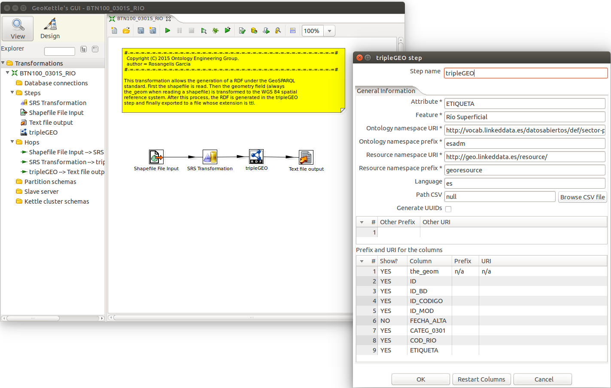

#geo.linkeddata.es-TripleGeoKettle

Repository where the integration of TripleGeo and GeoKettle is performed, used in the [geo.linkeddata.es](https://github.com/oeg-upm/geo.linkeddata.es-termite) project. The project documentation geo.linkeddata.es-TripleGeoKettle is on the [wiki](https://github.com/oeg-upm/geo.linkeddata.es-TripleGeoKettle/wiki).

##Screenshot

##License

The contents of this project are licensed under the [Apache License](./LICENSE)
